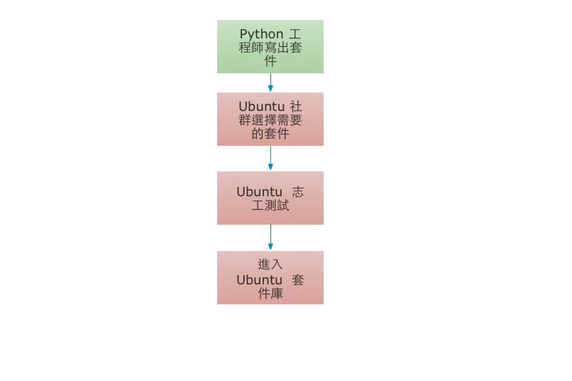
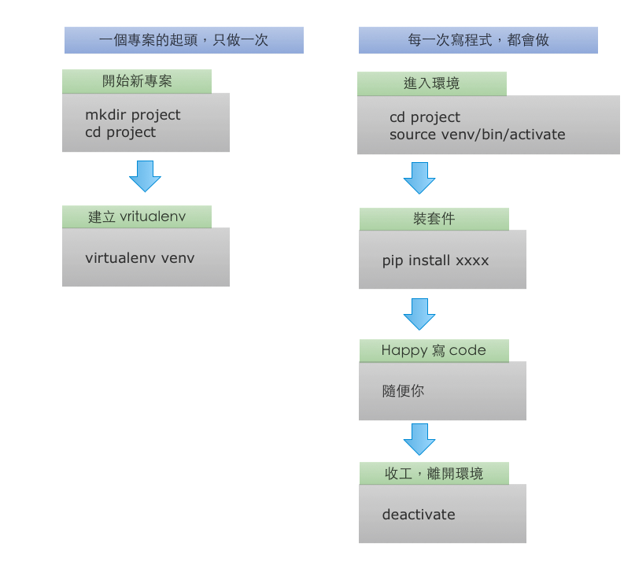

#工作的種類

要成為一個稱職的工程師，我們的第一步，就是要喜歡你的工具，善用你的工具，讓工具可以為你所用。

以及我們需要一些成長的脈絡，從一些工作的職位，你可以知道軟體工業，需要怎麼樣的技能。從這些名字裡面，你就可以有很多的想像，其中也隱含著你該怎麼充實自己。

* Developer
* Architect
* Operation
* Package Manager
* Release Manager
* Quality Assurance
* Test Development

讓自己達到高水準的境界很重要。但是別忘了，你提高水準的目的，是為了可以把問題解得又快又好，過程輕鬆快樂有成就感，不是把工具玩得很熟練而已。

#為你的系統增加功能

##系統的套件管理工具

為自己的系統安裝更多程式，比如說你在乾淨安裝的 ubutntu 下想要使用 vim, 你在 terminal 下打 vim, 你會看到如下的畫面：

```bash
tim@ubuntu:~$ vim

The program 'vim' can be found in the following packages:
 * vim
 * vim-gnome
 * vim-tiny
 * vim-athena
 * vim-gtk
 * vim-nox
Try: sudo apt-get install <selected package>
```

現在的系統畫面的訊息，請認真看，出錯之後的訊息，各種程式都很努力的想告訴你資訊，看不懂也要冷靜地去 google, 剛學寫程式的高牆，就是無法掌握錯誤訊息。

上面的訊息很直白的翻譯，就是系統沒有 vim 可以用，但是 ubuntu 認得 vim, ubuntu 很貼心給了你指引，我們就聽她的話，打入下面的指令就可以了。

```bash
sudo apt-get install vim
```
安裝好以後，你就可以在 terminal 上使用 vim 了。

ubutntu 系統的套件，都是靠 apt-get, apt-cache 這兩個指令來做管理。

```bash
apt-cache search 任何你聽過的工具
```

這些套件，都是 canonical 公司，以及 ubuntu 社群的義工的所維護的。每一個套件都有在 ubuntu 的環境好好測試執行過，所以都是值得信賴的。

* 程式語言的套件管理工具

先來玩一下 python 的 shell

```python
timdeMacBook-Pro:python-for-a-real-programer tim$ python
Python 2.7.6 (default, Sep  9 2014, 15:04:36)
[GCC 4.2.1 Compatible Apple LLVM 6.0 (clang-600.0.39)] on darwin
Type "help", "copyright", "credits" or "license" for more information.
>>> a = u'中文'
>>> a
u'\u4e2d\u6587'
>>>
```

u'\u4e2d\u6587' 在工程上很有用，是這兩個中文字的 unicode 編碼。 在資料存擋，網路傳輸時，都是有用的工具，但是若你想要觀察資料的時候，就很不方便了。

python 有一個套件叫做 [uniout](https://github.com/moskytw/uniout), 可以讓我們在 python 的 shell 下，可以觀察非英文語系的資料。

但用 apt-cache 尋找 uniout 時，是找不到的到？

仔細看一下 uniout 的官網，要安裝 uniout 你必須要下面的指令：

```bash
sudo pip install uniout
```

pip 就是 python 專用的套件管理軟體，試著把它裝好吧：


```bash
sudo apt-get install python-pip
```

喔不，為什麼不都用 ubuntu 的 apt-get 就好。


因為工作流程都是 Python 工程師製作好了套件以後。在被其他作業系統的志工收納進去。

因此，你要使用最新，最完整的 Python 套件，你要用 pip.

其實就連編輯器也有[套件管理工具](http://ithelp.ithome.com.tw/question/10131427) 不過這就超過我們這次的範圍了。

回到安裝 uniout.

請仔細看安裝完的結果, 下面是一般成功的狀態：

```bash
timdeMacBook-Pro:python-for-a-real-programer tim$ sudo pip install uniout
Downloading/unpacking uniout
  Downloading uniout-0.3.7.tar.gz
  Running setup.py egg_info for package uniout

    warning: no previously-included files matching '*.pyc' found anywhere in distribution
Installing collected packages: uniout
  Running setup.py install for uniout

    warning: no previously-included files matching '*.pyc' found anywhere in distribution
Successfully installed uniout
Cleaning up...
```
你會看到 successfully 這個令人振奮的字眼。

下面你忘記加上 sudo 的結果，你會看到 Permission denied.

```bash
error: /Library/Python/2.7/site-packages/_uniout.py: Permission denied

----------------------------------------
Cleaning up...
Command /usr/bin/python -c "import setuptools;__file__='/private/var/folders/7r/0m7j9n750xn_hfh73nly7sk00000gn/T/pip_build_tim/uniout/setup.py';exec(compile(open(__file__).read().replace('\r\n', '\n'), __file__, 'exec'))" install --record /var/folders/7r/0m7j9n750xn_hfh73nly7sk00000gn/T/pip-q4LqDZ-record/install-record.txt --single-version-externally-managed failed with error code 1 in /private/var/folders/7r/0m7j9n750xn_hfh73nly7sk00000gn/T/pip_build_tim/uniout
Storing complete log in /Users/tim/Library/Logs/pip.log
```
如果你的帳號沒有 root 權限。就嘗試使用下面的方式安裝，這時會把套件裝到 家目錄下的 .local/lib/python2.7/site-packages/ 裡面。

```bash
pip install --user uniout
```

裝好 uniout, 請重新開啟 Python 的 shell.

```python
>>> exit()
```

你可以在 python shell 裡面開心觀察中文了。
```python
Python 2.7.6 (default, Sep  9 2014, 15:04:36)
[GCC 4.2.1 Compatible Apple LLVM 6.0 (clang-600.0.39)] on darwin
Type "help", "copyright", "credits" or "license" for more information.
>>> import uniout
>>> a = u'中文'
>>> a
u'中文'
```

## 小結：套件安裝

系統有自己的套件安裝工具 apt-get, apt-cache, 你可以裝很多很豐富的東西，而且都有人幫你測試好了，讓你可以不用擔心裝到有問題的軟體。 Python 有自己的套件管理工具，讓你管理 Python 的套件。

#Virtual Environment

用剛剛教下的方法把套件裝進系統裡，在你隨意做實驗的情境之下，完全沒有問題。 但是若你已經是一個專業的 python 程式設計師的話，你最好開始使用 [virtualenv](http://virtualenv.readthedocs.org/en/latest/virtualenv.html).

```bash
sudo pip install virtualenv
```

ubuntu 提供的套件，通常都會比 python 官方提供的套件舊一點點，但是有經過 ubuntu 官方完整測試過。但若你貿然使用 pip 裝了新套件，那就沒有經過 ubuntu 完整測試過，或許就會讓系統陷入不穩定的狀態。另外，若是我們維護一個稍舊的專案。這個專案會需要比較舊的套件，這時，等於是把你的系統降級了。 另外你的手上有多個專案同時逕行，你會需要這些專案各自使用自己的套件，不要互相影響。

建立一個 virtualenv 的方法如下：

```bash
virtualenv venv
```

進入 virtualenv:

```bash
source venv/bin/activate
```

離開 virtualenv, 直接把 terminal 關了也行，virtualenv 只會影響你正在使用的 bash shell

```bash
deactivate
```


virtualenv 可以完美解決上述的問題。 所以以下的工作流程，可以多做練習，養成習慣。



最後，若是系統常常裝了亂七八糟的套件，使用 virtualenv 更有砍掉重練，乾乾淨淨重新開始的感覺，有時一些套件運作不正常的問題，也可以在使用 virtualenv 之下迎刃而解。

##練習

請在 /tmp/下開始使用 virtualenv，在 virtualenv 裡面安裝 [pycuber](https://github.com/adrianliaw/pycuber) 玩一玩。

最後離開 virtualenv，請你確認離開以後的 python shell, 是沒有 pycuber 的。


##virtualenvwrapper


若是覺得virtualenv的指令過於冗長，推薦使用[virtualenvwrapper](https://virtualenvwrapper.readthedocs.org/en/latest/)，它可以讓你以較短的指令，達到的相同的目的，並提供許多virtualenv沒有的功能。

首先在原始環境下安裝virtualenvwrapper

```bash
pip install virtualenvwrapper
```

接著在shell的設定檔(.zshrc, .bashrc)中加入

```bash
# 建置虛擬環境目錄(相關檔案與虛擬環境目錄會放在.virtualenvs中)
export WORKON_HOME=$HOME/.virtualenvs
source /usr/local/bin/virtualenvwrapper.sh
```

重新啟動shell後，即可使用virtualenvwrapper的指令

建置虛擬環境

```bash
mkvirtualenv env_name
```

刪除虛擬環境

```bash
rmvirtualenv env_name
```

列出所有的虛擬環境

```bash
workon
```

進入虛擬環境（可用tab補全）

```bash
workon env_name
```


##建置python3虛擬環境

目前virtualenvwrapper預設的python環境為python2，
加上`--python`參數，即可以python3為主

```bash
$ mkvirtualenv --python=/usr/local/bin/python3 env_name
```

(等號後面放python3所在的路徑)


##requirements.txt
通常會利用`requirements.txt`紀錄目前環境下使用的python套件，
以便與他人分享或快速建置相同的作業環境

建置

```bash
pip freeze > requirements.txt
```

安裝

```bash
pip install -r requirements.txt
```

