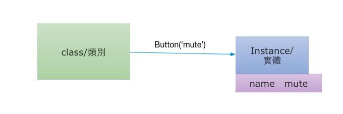

# Python: 物件導向的 Script Language

請看[ Python 2.7 的官網教學的第一段話 ](https://docs.python.org/2.7/tutorial/index.html)

> Python is an easy to learn, powerful programming language. It has efficient high-level data structures and a simple but effective approach to object-oriented programming. Python’s elegant syntax and dynamic typing, together with its interpreted nature, make it an ideal language for scripting and rapid application development in many areas on most platforms.

這裡，我想先特別強調 Object Oriented

物件導向是一種觀念，想要解決的問題，是希望讓程式碼可以更容易被重複使用，以及可讀性更好，更容易理解，可以跟我們平常生活的經驗可以連結。


# start - 萬物皆物件


Python 時常在建立物件，以及對物件做操作。 物件導向的程式碼，想解決的問題，就是希望程式碼可以不要有重複 （Don't Repeat Yourself 法則), 以及為程式碼做足夠的抽象化。

在物件導向程式設計當中，我們會試著讓程式是由一個個彼此之間能夠互動的單元組成。

就好像之前的例子：

```python
numbers = list()
numbers.append(10)
numbers.append(3)
numbers.append(9)
print numbers  # [10, 3, 9]
numbers.sort()
print numbers  # [3, 9, 10]
```

list() 建立了一個 list 物件。 貼上了一個標籤叫做 numbers。

numbers 有很多的 method 可以使用，這裏我們使用 list 的 append method.  把數字加到 list 的後面去。 最後使用 list 的 sort method. 把 numbers 排序.

如果我們也想要依樣畫葫蘆呢設計物件呢？

你需要幾個關鍵字：

* class
* def

class 之後要接著你想創造的物件的種類名稱

```python
class Button:
    'nothing here is only comment'

button = Button()

```

上面定義了一個類別(class) 叫做 Button, button = Button() 這一行產生了一個 button 物件。


```python
class Button:
   def click(self):
       print "I am clicked"


a = Button()
a.click() # I am clicked
```

甚至是可以為物件增加屬性

```python
class Button:
    def click(self):
        print "{0} is clicked".format(self.name)


powerup_button = Button()
powerup_button.name = 'power up'
powerup_button.click()   # power up is clicked

powerdown_button = Button()
powerdown_button.name = 'power down'
powerdown_button.click()  #  power down is clicked
```

最後大家喜歡額外的屬性在建構的時候就可以指定好, 所以喜歡如下的寫法。

```python
class Button:
    def __init__(self, name):
        self.name = name

    def click(self):
        print "{0} is clicked".format(self.name)

mute = Button('mute')
mute.click() # mute is clicked
```


讓一個物件在產生的時候，就把所需要的外界資源就收集好，會讓程式非常清楚簡單。

當我們執行 Button('mute') 來建立 instance 的時候, 會直接呼喚\_\_init\__ 這個特別的函數, 第一個參數永遠會是
instance, 第二個參數以後，才會是外界傳入的參數。在我們的例子就是 'mute'。


上面的程式碼，可以用下面的圖來概略說明：



也會有人說，類別是 PowerPoint 的範本，實體是你每一次製作的 ppt 檔案。

如果上面還霧颯颯，可以再參考[搞笑談軟工](http://teddy-chen-tw.blogspot.tw/2012/01/2object-class-instance.html)這篇文章

## 練習

我們來製作一個電視 class，並且為電視裡面擺放按鈕。


## Reference

[Django Girl ](http://djangogirlstaipei.herokuapp.com/tutorials/python/)
